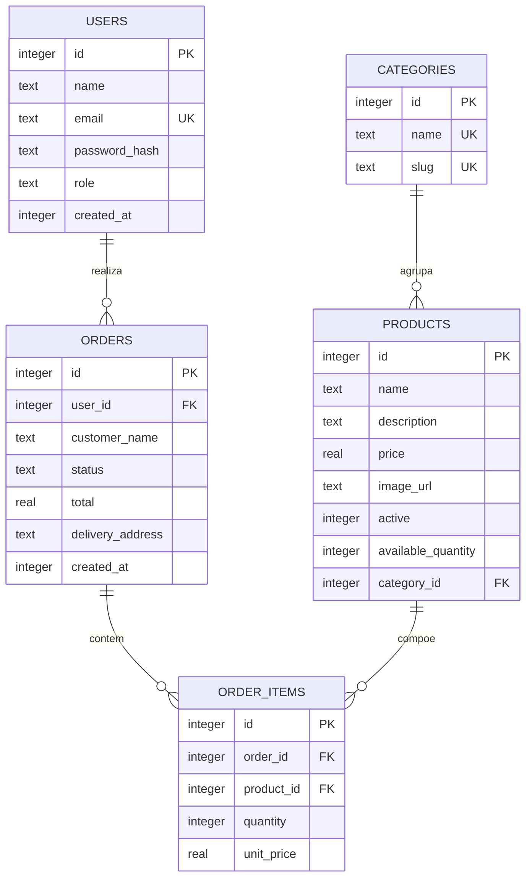

# Banco de Dados — Projeto Físico e Dicionário de Dados

Documento da **Situação 1** do PIT II: estrutura do banco de dados da aplicação **Cupcake Gourmet**.

- **SGBD:** SQLite (arquivo `./database/sqlite.db`) — leve, embutido e de fácil manutenção/população.
- **ORM:** Drizzle ORM + drizzle-kit (schema versionado em `src/database/schema/schema.ts`).
- **Criação/atualização do schema:** `pnpm db:push`.
- **População inicial (seed):** `pnpm db:seed`.
- **Inspeção:** `pnpm db:studio`.

> O SQLite foi escolhido por ser um SGBD relacional amplamente adotado, sem servidor externo, ideal para o escopo do projeto e de fácil backup (arquivo único). O ORM mantém o schema versionado junto ao código no Git.

## 1. Diagrama Entidade-Relacionamento (DER)



### Relacionamentos

| Relação | Cardinalidade | Regra |
| --- | --- | --- |
| `categories` → `products` | 1 : N | Todo produto pertence a **uma** categoria (RN02). |
| `users` → `orders` | 1 : N | Pedido pode ter usuário (**opcional**); no fluxo atual o checkout exige login de `CLIENTE`. |
| `orders` → `order_items` | 1 : N | Um pedido possui um ou mais itens. |
| `products` → `order_items` | 1 : N | O `unit_price` congela o preço do produto no pedido (RN07). |

## 2. Dicionário de Dados

### 2.1 `users` — usuários do sistema

| Coluna | Tipo | Restrições | Descrição |
| --- | --- | --- | --- |
| `id` | INTEGER | PK, autoincremento | Identificador do usuário. |
| `name` | TEXT | NOT NULL | Nome do usuário. |
| `email` | TEXT | NOT NULL, UNIQUE | E-mail usado no login (não pode repetir). |
| `password_hash` | TEXT | NOT NULL | Hash da senha (argon2). Nenhuma senha em texto puro. |
| `role` | TEXT | NOT NULL, DEFAULT `CLIENTE`, enum `CLIENTE`/`ADMIN` | Perfil de acesso. |
| `created_at` | INTEGER (timestamp) | NOT NULL, DEFAULT `unixepoch()` | Data de criação. |

### 2.2 `categories` — categorias do catálogo

| Coluna | Tipo | Restrições | Descrição |
| --- | --- | --- | --- |
| `id` | INTEGER | PK, autoincremento | Identificador da categoria. |
| `name` | TEXT | NOT NULL, UNIQUE | Nome exibido (ex.: *Gourmet*). |
| `slug` | TEXT | NOT NULL, UNIQUE | Identificador amigável para URL (ex.: `gourmet`). |

### 2.3 `products` — cupcakes/produtos

| Coluna | Tipo | Restrições | Descrição |
| --- | --- | --- | --- |
| `id` | INTEGER | PK, autoincremento | Identificador do produto. |
| `name` | TEXT | NOT NULL | Nome do produto. |
| `description` | TEXT | NOT NULL | Descrição completa. |
| `price` | REAL | NOT NULL | Preço unitário (> 0 — RN02). |
| `image_url` | TEXT | NULL | URL da imagem. |
| `active` | INTEGER (boolean) | NOT NULL, DEFAULT `true` | Só produtos ativos aparecem no catálogo (RN01). |
| `available_quantity` | INTEGER | NOT NULL, DEFAULT `0` | Estoque disponível (RN13–RN15, RN17). |
| `category_id` | INTEGER | NOT NULL, FK → `categories.id` | Categoria do produto. |

### 2.4 `orders` — pedidos

| Coluna | Tipo | Restrições | Descrição |
| --- | --- | --- | --- |
| `id` | INTEGER | PK, autoincremento | Identificador do pedido. |
| `user_id` | INTEGER | NULL, FK → `users.id` | Dono do pedido (opcional no modelo). |
| `customer_name` | TEXT | NOT NULL | Nome de entrega informado no checkout. |
| `status` | TEXT | NOT NULL, DEFAULT `PENDENTE`, enum `PENDENTE`/`PAGAMENTO_REALIZADO`/`CANCELADO` | Estado do pedido (RN08, RN09, RN16). |
| `total` | REAL | NOT NULL | Valor total congelado no checkout (RN07). |
| `delivery_address` | TEXT | NOT NULL | Endereço de entrega. |
| `created_at` | INTEGER (timestamp) | NOT NULL, DEFAULT `unixepoch()` | Data de criação. |

### 2.5 `order_items` — itens do pedido

| Coluna | Tipo | Restrições | Descrição |
| --- | --- | --- | --- |
| `id` | INTEGER | PK, autoincremento | Identificador do item. |
| `order_id` | INTEGER | NOT NULL, FK → `orders.id` | Pedido ao qual o item pertence. |
| `product_id` | INTEGER | NOT NULL, FK → `products.id` | Produto comprado. |
| `quantity` | INTEGER | NOT NULL | Quantidade (1–99 — RN03). |
| `unit_price` | REAL | NOT NULL | Preço unitário congelado no momento do pedido. |

## 3. Projeto Físico — DDL (SQLite)

DDL equivalente gerado a partir do ORM:

```sql
CREATE TABLE users (
  id            INTEGER PRIMARY KEY AUTOINCREMENT,
  name          TEXT    NOT NULL,
  email         TEXT    NOT NULL UNIQUE,
  password_hash TEXT    NOT NULL,
  role          TEXT    NOT NULL DEFAULT 'CLIENTE',
  created_at    INTEGER NOT NULL DEFAULT (unixepoch())
);

CREATE TABLE categories (
  id   INTEGER PRIMARY KEY AUTOINCREMENT,
  name TEXT    NOT NULL UNIQUE,
  slug TEXT    NOT NULL UNIQUE
);

CREATE TABLE products (
  id                 INTEGER PRIMARY KEY AUTOINCREMENT,
  name               TEXT    NOT NULL,
  description        TEXT    NOT NULL,
  price              REAL    NOT NULL,
  image_url          TEXT,
  active             INTEGER NOT NULL DEFAULT 1,
  available_quantity INTEGER NOT NULL DEFAULT 0,
  category_id        INTEGER NOT NULL REFERENCES categories(id)
);

CREATE TABLE orders (
  id               INTEGER PRIMARY KEY AUTOINCREMENT,
  user_id          INTEGER REFERENCES users(id),
  customer_name    TEXT    NOT NULL,
  status           TEXT    NOT NULL DEFAULT 'PENDENTE',
  total            REAL    NOT NULL,
  delivery_address TEXT    NOT NULL,
  created_at       INTEGER NOT NULL DEFAULT (unixepoch())
);

CREATE TABLE order_items (
  id         INTEGER PRIMARY KEY AUTOINCREMENT,
  order_id   INTEGER NOT NULL REFERENCES orders(id),
  product_id INTEGER NOT NULL REFERENCES products(id),
  quantity   INTEGER NOT NULL,
  unit_price REAL    NOT NULL
);
```

## 4. Dados de exemplo (seed)

O seed cria um usuário administrador, uma conta de cliente exemplo, três categorias e seis produtos:

**Usuários**

| Perfil | Nome | E-mail | Senha |
| --- | --- | --- | --- |
| ADMIN | Administrador | `admin@cupcake.local` | `admin123` |
| CLIENTE | Cliente Exemplo | `cliente@cupcake.local` | `cliente123` |

**Categorias:** Tradicionais (`tradicionais`), Gourmet (`gourmet`), Veganos (`veganos`).

**Produtos**

| Produto | Categoria | Preço | Estoque |
| --- | --- | --- | --- |
| Baunilha Clássico | Tradicionais | R$ 8,50 | 20 |
| Chocolate Belga | Tradicionais | R$ 9,00 | 15 |
| Red Velvet | Gourmet | R$ 12,00 | 12 |
| Pistache com Framboesa | Gourmet | R$ 14,50 | 8 |
| Vegano de Coco | Veganos | R$ 10,00 | 10 |
| Vegano de Cacau | Veganos | R$ 10,50 | 0 (esgotado) |

## 5. Observações de integridade

- Não há `ON DELETE CASCADE`: a exclusão de registros referenciados é evitada no nível da aplicação, preservando o histórico de pedidos.
- O carrinho **não** é uma tabela do banco — é mantido em cookie `httpOnly` e revalidado contra o banco a cada requisição.
- As regras de negócio (`RN01`–`RN17`) detalhadas em [`requirements.md`](requirements.md) são aplicadas na camada de serviço.
- Nenhum dado sensível é versionado: o arquivo `database/*.db` e o `.env` ficam no `.gitignore`.
